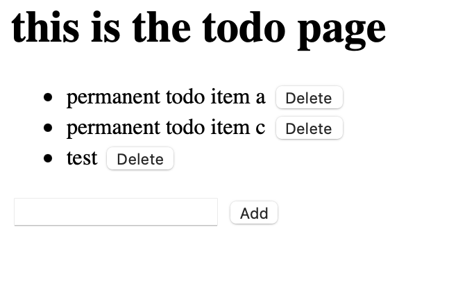

# Description
This program generates a 2-player Tron game.  Controls for player 1 are W,A,S,D for directions and LSHIFT for boost.  COntrols for player 2 are UP,LEFT,DOWN,RIGHT for directions and RSHIFT for boost.

# Execution

# Useful Sites

https://docs.djangoproject.com/en/3.1/
https://www.youtube.com/watch?v=h7rvyDK70FA